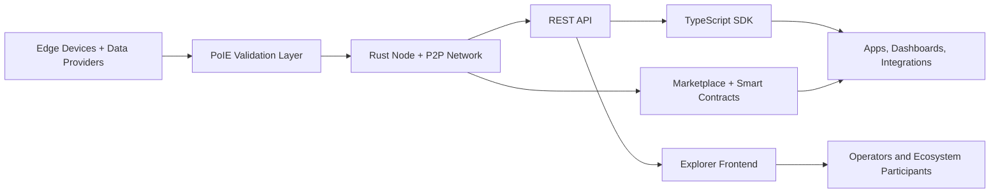

# EdgeAI Alpha

**EdgeAI Alpha** is an alpha-stage blockchain stack for edge AI and IoT networks that need verifiable data contribution, incentive alignment, and application-facing infrastructure.

This monorepo combines a Rust node, a React explorer, a TypeScript SDK, and documentation into one repository for teams evaluating the project as infrastructure, an integration surface, or a collaboration candidate.

## Repository status

| Item | Status |
|------|--------|
| Visibility | Public |
| Stage | Alpha |
| Live explorer | [edgeai-alpha.vercel.app](https://edgeai-alpha.vercel.app) |
| Live API demo | [edgeai-blockchain-node.fly.dev/api/chain](https://edgeai-blockchain-node.fly.dev/api/chain) |
| Repository role | Monorepo for node, explorer, SDK, and docs |
| Primary stack | Rust, Actix Web, React 19, TypeScript |

## Why this matters

Edge AI systems depend on distributed devices generating data outside centralized environments. That creates a recurring coordination problem:

- how to verify which data is valuable,
- how to reward contributors fairly,
- how to expose network state to developers and operators,
- how to turn raw device participation into an application-ready platform.

EdgeAI Alpha is built around that coordination layer.

## What is in this repository

### 1. Blockchain node

A Rust-based node with consensus, storage, networking, REST APIs, and smart contract support for edge-oriented workloads.

### 2. Explorer frontend

A React-based explorer for monitoring chain activity, validator participation, transaction flows, and operator-facing dashboards.

### 3. TypeScript SDK

A typed client for integrating applications, dashboards, and services with EdgeAI network endpoints.

### 4. Documentation workspace

A Docusaurus docs package for onboarding developers, node operators, and ecosystem participants.

## Current status

- **Stage:** Alpha
- **Repository model:** Active monorepo with node, explorer, SDK, and docs
- **Live surfaces:** Public explorer and API demo endpoints are available
- **Intended audience:** Developers, infrastructure partners, data networks, and edge/IoT platform teams

## Visual assets

Repository-ready screenshots should be added under [docs/media](./docs/media/README.md). The recommended set is:

- explorer dashboard overview,
- validator or network visualization,
- transaction or marketplace flow,
- SDK or developer integration view.

## Why it is relevant for partners

EdgeAI Alpha is positioned as infrastructure for teams that need trustworthy data coordination at the edge. The project is most relevant to:

- **Edge AI and IoT platforms** that need device registration, contribution tracking, and reward logic
- **Data marketplace partners** exploring pricing, listing, and purchasing flows for machine-generated data
- **Developers and integrators** that need APIs, dashboards, and SDK access rather than raw node software alone
- **Ecosystem collaborators** interested in staking, governance, or network operations tooling

## Architecture



## Core capabilities

### Consensus and network coordination

- **PoIE consensus:** Proof of Information Entropy to evaluate and reward higher-value data contribution
- **P2P networking:** libp2p-based peer discovery, synchronization, and node communication
- **Persistent state:** Automatic blockchain state storage and recovery

### Data and application layer

- **Data marketplace:** Listing, purchasing, quality scoring, and transaction history
- **Smart contracts:** Marketplace, federated learning, and device registration contract flows
- **REST API:** Application-facing HTTP endpoints for chain, accounts, transactions, and network state

### User-facing surfaces

- **Real-time explorer:** Chain metrics, blocks, transactions, and validator activity
- **Network visualization:** Geographic and topology-style monitoring views
- **SDK support:** Type-safe integration path for external developers

## Project structure

```text
edgeai-alpha/
├── backend/          # Rust blockchain node and API layer
├── frontend/         # React + TypeScript explorer
├── sdk/              # TypeScript SDK
├── docs/             # Docusaurus documentation workspace
└── README.md         # Repository overview
```

## Quick start

### Run a node with Docker

```bash
docker run -d \
  --name edgeai-node \
  -p 8080:8080 \
  -p 9000:9000 \
  -v edgeai_data:/data \
  --restart always \
  ghcr.io/edgeai-chain/edgeai-alpha/edgeai-node:latest
```

### Build from source

#### Backend

```bash
cd backend
cargo build --release
./target/release/edgeai-node
```

After starting the node:

- API endpoint: http://localhost:8080/api/
- Built-in explorer: http://localhost:8080/

#### Frontend

```bash
cd frontend
pnpm install
pnpm dev
```

Development server: http://localhost:3000

### SDK installation

```bash
npm install @edgeai/sdk
# or
pnpm add @edgeai/sdk
```

```typescript
import { EdgeAIClient } from '@edgeai/sdk';

const client = new EdgeAIClient({
  baseUrl: 'https://edgeai-blockchain-node.fly.dev'
});

const chainInfo = await client.getChainInfo();
console.log(`Block Height: ${chainInfo.height}`);
```

## Tech stack

| Component | Technology |
|-----------|------------|
| **Backend Language** | Rust |
| **Backend Framework** | Actix Web |
| **Frontend Framework** | React 19 + TypeScript |
| **Build Tool** | Vite |
| **UI Components** | Tailwind CSS + shadcn/ui |
| **Data Visualization** | Recharts, Cobe (3D Globe) |
| **Documentation** | Docusaurus |

## Live demo

- **Explorer:** [https://edgeai-alpha.vercel.app](https://edgeai-alpha.vercel.app)
- **API:** [https://edgeai-blockchain-node.fly.dev/api/chain](https://edgeai-blockchain-node.fly.dev/api/chain)

## License

MIT License

## Contributing

Issues and pull requests are welcome.
